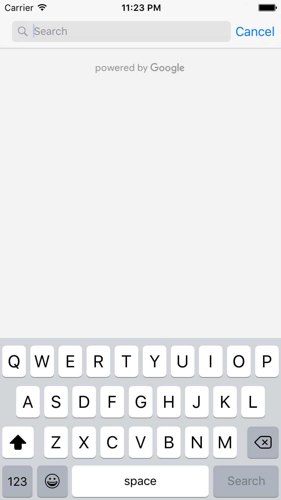
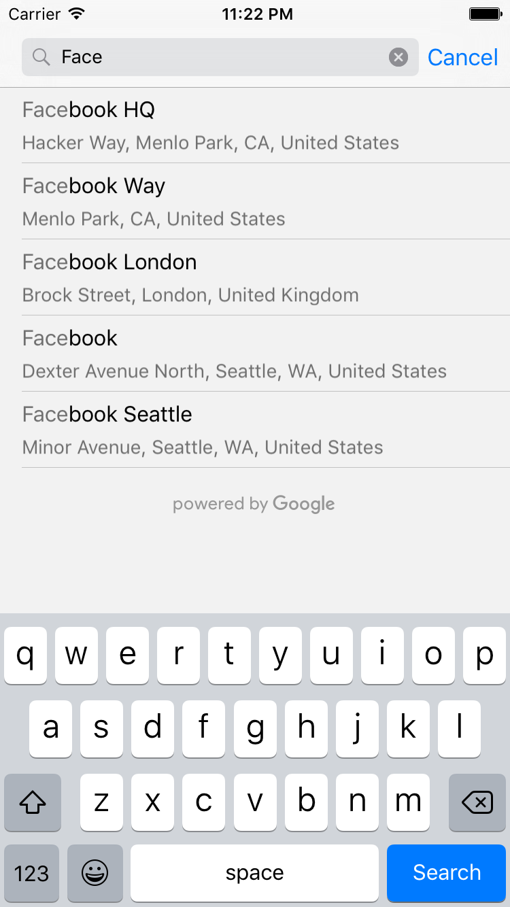
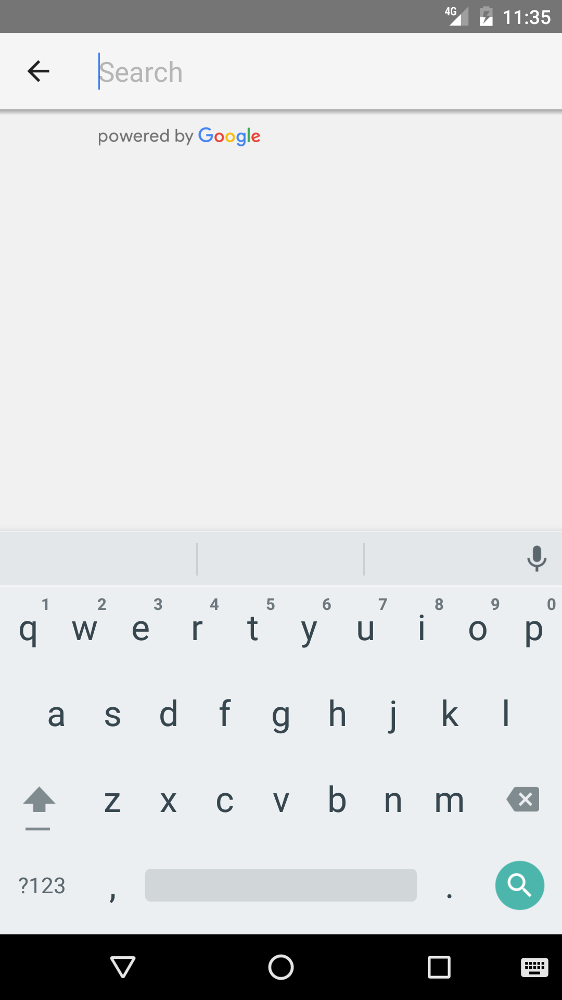
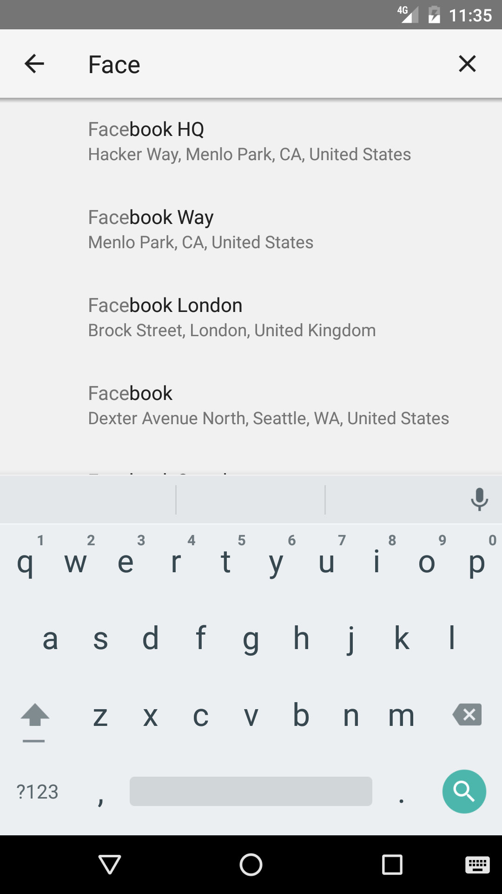
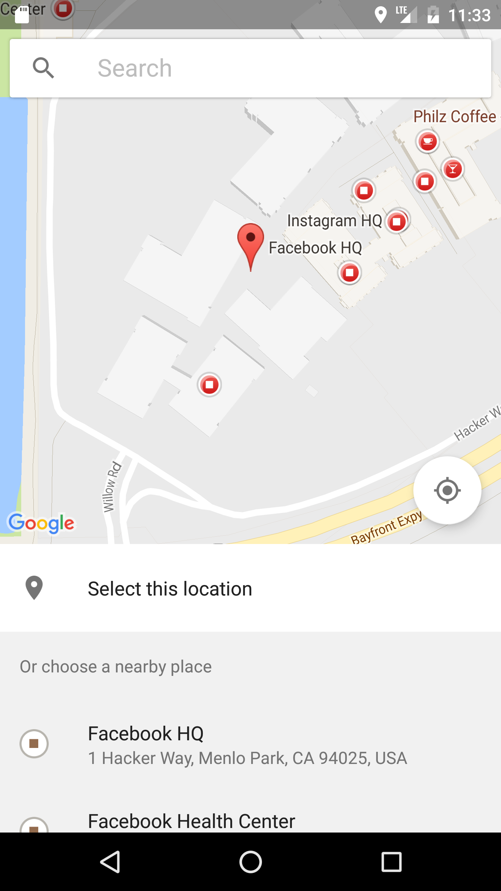
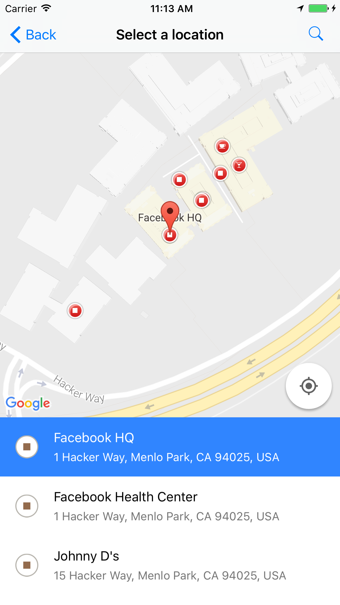

# react-native-google-places
iOS/Android Google Places Widgets (Autocomplete Modal) and API Services for React Native Apps

### **Notice: The Google Play Services version of the Places SDK for Android (in Google Play Services 16.0.0) is deprecated as of January 29, 2019, and will be turned off on July 29, 2019. A new version of the Places SDK for Android is now available. I suggest you read the documentations again and update your app to use v3.0.1 (or above) of this package**

## Shots








## Versioning:
- for RN >= 0.40.0, use v3+ (e.g. react-native-google-places@3.1.0)
- If you are still using the v2 of this library, you really should not, then **[Version 2 Documentations](/READMEV2.md)**

## Sample App
- A new [Sample App](https://github.com/tolu360/RNGPDemos) is available to help with sample usage and debugging issues.

## Install

```
npm i react-native-google-places --save
```
OR

```
yarn add react-native-google-places
```

#### Google Places API Set-Up
1. Sign up for [Google Places & Google Maps APIs for Android in Google API Console](https://cloud.google.com/maps-platform/#get-started) to grab your Android API key (not browser key).
2. Read further API setup guides at [https://developers.google.com/places/android-sdk/signup](https://developers.google.com/places/android-sdk/signup).
3. Similarly, sign up for [Google Places API for iOS in Google API Console](https://cloud.google.com/maps-platform/#get-started) to grab your iOS API key (not browser key).
4. Ensure you check out further guides at [https://developers.google.com/places/ios-sdk/get-api-key](https://developers.google.com/places/ios-sdk/get-api-key).
5. [Enable billing](https://console.cloud.google.com/project/_/billing/enable) for your projects - **please do not file any issues on this repo without first checking you have, indeed, enabled billing on your account**.
6. With both keys in place, you can proceed.

#### Post-Install Steps (iOS)

##### 1) Auto Linking & Cocoapods Integration
- If you do not have CocoaPods already installed on your machine, run `gem install cocoapods` to set it up the first time. (Hint: Go grab a cup of coffee!)
- If you are not using Cocoapods in your project already, run `cd ios && pod init` at the root directory of your project. This would create a `Podfile` in your `ios` directory.
- Run `react-native link react-native-google-places` at the root directory of your project and ensure you edit your Podfile to look like the sample below (remove all the targets you are not building for, such as Tests and tvOS):

```ruby
# platform :ios, '9.0'

target '_YOUR_PROJECT_TARGET_' do

  # Pods for _YOUR_PROJECT_TARGET_
  pod 'React', :path => '../node_modules/react-native', :subspecs => [
    'Core',
    'CxxBridge',
    'DevSupport',
    'RCTText',
    'RCTImage',
    'RCTNetwork',
    'RCTWebSocket',
    'RCTSettings',
    'RCTAnimation',
    'RCTLinkingIOS',
    # Add any other subspecs you want to use in your project
    # Remove any subspecs you don't want to use in your project
  ]

  pod "yoga", :path => "../node_modules/react-native/ReactCommon/yoga"
  pod 'DoubleConversion', :podspec => '../node_modules/react-native/third-party-podspecs/DoubleConversion.podspec'
  pod 'glog', :podspec => '../node_modules/react-native/third-party-podspecs/glog.podspec'
  pod 'Folly', :podspec => '../node_modules/react-native/third-party-podspecs/Folly.podspec'
  # This should already be auto-added for you, if not add the line below
  pod 'react-native-google-places', :path => '../node_modules/react-native-google-places'

end

post_install do |installer|
  installer.pods_project.targets.each do |target|
    if target.name == 'react-native-google-places'
      target.build_configurations.each do |config|
        config.build_settings['CLANG_ENABLE_MODULES'] = 'No'
      end
    end
    if target.name == "React"
      target.remove_from_project
    end
  end
end
```

- Replace all references to _YOUR_PROJECT_TARGET_ with your project target (it's the same as project name by default).
- By now, you should be all set to install the packages from your Podfile. Run `pod install` from your `ios` directory.
- Close Xcode, and then open (double-click) your project's .xcworkspace file to launch Xcode. From this time onwards, you must use the `.xcworkspace` file to open the project. Or just use the `react-native run-ios` command as usual to run your app in the simulator.

##### 2) Configuration on iOS
- In your `AppDelegate.m` file, import the Google Places library by adding 
```objectivec
    @import GooglePlaces; 
    @import GoogleMaps;
```
on top of the file.
- Within the `didFinishLaunchingWithOptions` method, instantiate the library as follows - **read about a better way to secure this below**:

```objectivec
[GMSPlacesClient provideAPIKey:@"YOUR_IOS_API_KEY_HERE"];
[GMSServices provideAPIKey:@"YOUR_IOS_API_KEY_HERE"];
```

- Ensure you have the required location permissions for the application by declaring keys for `NSLocationWhenInUseUsageDescription` and `NSLocationAlwaysAndWhenInUseUsageDescription` in your `info.plist` file, either using Xcode or manually editing the file e.g. 

```plist
<key>NSLocationWhenInUseUsageDescription</key>
	<string>RNGPDemos needs your location to show you places</string>
	<key>NSLocationAlwaysAndWhenInUseUsageDescription</key>
	<string>RNGPDemos needs your location to show you places</string>
```


#### Post-Install Steps (Android)

##### Auto Linking With Your Project
- This was done automatically for you when you ran `react-native link react-native-google-places`. Or you can run the command now if you have not already.
- In your `AndroidManifest.xml` file, request the following permissions:

```xml
<uses-permission android:name="android.permission.ACCESS_FINE_LOCATION" />

<uses-permission android:name="android.permission.ACCESS_WIFI_STATE" />
```

- In your `/android/gradle.properties` file, add your API key, **read about a better way to secure this below**

```groovy
RNGP_ANDROID_API_KEY=Insert_API_KEY_here
```

##### Manual Linking With Your Project (Android)
- The following additional setup steps are optional as they should have been taken care of, for you when you ran `react-native link react-native-google-places`. Otherwise, do the following or just ensure they are in place;
- Add the following in your `android/settings.gradle` file:

```groovy
include ':react-native-google-places'
project(':react-native-google-places').projectDir = new File(rootProject.projectDir, '../node_modules/react-native-google-places/android')
```
- Add the following in your `android/app/build.grade` file:

```groovy
dependencies {
    ...
    compile project(':react-native-google-places')
}
```

- Add the Google Maven Repo in your `android/build.gradle` file:

```groovy
allprojects {
    repositories {
        ...
        maven {
            // All of React Native (JS, Obj-C sources, Android binaries) is installed from npm
            url "$rootDir/../node_modules/react-native/android"
        }
        maven {
            url "https://maven.google.com" 
        }
    }
}
```

- Add the following in your `...MainApplication.java` file:

```java
import com.arttitude360.reactnative.rngoogleplaces.RNGooglePlacesPackage;

@Override
protected List<ReactPackage> getPackages() {
  return Arrays.<ReactPackage>asList(
      new MainReactPackage(),
      ...
      new RNGooglePlacesPackage() //<-- Add line
  );
}
```

##### Additional Requirement (Android)

- Enable multiDex for your application.
- Ensure you are compiling with `Java 1.8 or above`. Add the following in your `/android/app/build.gradle` file:

```groovy
android {
    defaultConfig {
        ...
        multiDexEnabled true
    }
    compileOptions {
        sourceCompatibility JavaVersion.VERSION_1_8
        targetCompatibility JavaVersion.VERSION_1_8
    }
}
```


- Finally, we can run `react-native run-android` to get started.


## Usage

###  Allows your users to enter place names and addresses - and autocompletes your users' queries as they type.

#### Import library

```javascript
import RNGooglePlaces from 'react-native-google-places';
```

#### Open Autocomplete Modal (e.g as Callback to an onPress event)


```javascript
class GPlacesDemo extends Component {
  openSearchModal() {
    RNGooglePlaces.openAutocompleteModal()
    .then((place) => {
		console.log(place);
		// place represents user's selection from the
		// suggestions and it is a simplified Google Place object.
    })
    .catch(error => console.log(error.message));  // error is a Javascript Error object
  }

  render() {
    return (
      <View style={styles.container}>
        <TouchableOpacity
          style={styles.button}
          onPress={() => this.openSearchModal()}
        >
          <Text>Pick a Place</Text>
        </TouchableOpacity>
      </View>
    );
  }
}
```

##### **Optional Parameters**
To customize autocomplete results as listed for [Android](https://developers.google.com/places/android-sdk/autocomplete) and [iOS](https://developers.google.com/places/ios-sdk/autocomplete) in the official docs, you can pass an `options` object as a parameter to the `openAutocompleteModal()` method as follows:

```javascript
    RNGooglePlaces.openAutocompleteModal({
            initialQuery: 'vestar', 
            locationRestriction: {
                latitudeSW: 6.3670553, 
                longitudeSW: 2.7062895, 
                latitudeNE: 6.6967964, 
                longitudeNE: 4.351055
            },
            country: 'NG',
            type: 'establishment'
        }, ['placeID', 'location', 'name', 'address', 'types', 'openingHours', 'plusCode', 'rating', 'userRatingsTotal', 'viewport']
    )
    .then((place) => {
        console.log(place);
    })
    .catch(error => console.log(error.message));
```
**OPTIONS**
- **`type`** _(String)_ - The type of results to return. Can only be one of (`geocode`, `address`, `establishment`, `regions`, and `cities`). *(optional)*
- **`country`** _(String)_ - Limit results to a specific country using a [ISO 3166-1 Alpha-2 country code](https://en.wikipedia.org/wiki/ISO_3166-1_alpha-2) (case insensitive). If this is not set, no country filtering will take place. *(optional)*
- **`locationBias`** _(Object)_ - To bias autocomplete results to a specific geographic region, pass an object (with the keys: `latitudeNE` _(Number)_, `longitudeNE` _(Number)_, `latitudeSW` _(Number)_, `longitudeSW` _(Number)_)  representing the bounding box for the region. *(optional)*
- **`locationRestriction`** _(Object)_ - To restrict autocomplete results to a specific geographic region, pass an object (with the keys: `latitudeNE` _(Number)_, `longitudeNE` _(Number)_, `latitudeSW` _(Number)_, `longitudeSW` _(Number)_)  representing the bounding box for the region. *(optional)* 
- **`useOverlay`** _(Boolean)_ [Android Only] - If true, the autocomplete modal will open as an [overlay rather than fullscreen](https://developers.google.com/places/images/acw_overlay.png). Defaults to `false`.
- **`initialQuery`** _(String)_ [Android Only] - If present, the autocomplete modal would launch with results pre-populated for the query passed *(optional)*.

**NOTE** - On iOS, only one of `locationBias` or `locationRestriction` is respected, when passing both, only the first passed option would be used.

**PLACE FIELDS**
- To prevent yourself from incurring huge usage bill, you can select the result fields you need in your application. Pass an *(optional)* `placeFields` as the second param to `openAutocompleteModal`.
- **placeFields** is an **`Array`** of `String` such as `placeID`, `location`, `name`, `address`, `types`, `openingHours`, `plusCode`, `rating`, `userRatingsTotal`, `viewport`, `website`, `phoneNumber`, `plusCode` and `addressComponents` _(available in v3.0.1+)_.
- Defaults to an empty array which returns every field possible for the particular place.


#### Example Response from the Autocomplete Modal
```javascript
{   priceLevel: 0,
    viewport: {   
        longitudeSW: 3.320172219708498,
        latitudeSW: 6.572546249999999,
        longitudeNE: 3.322870180291502,
        latitudeNE: 6.584909250000001 
    },
    address: 'Lagos, Nigeria',
    location: {   
        longitude: 3.3211348, 
        latitude: 6.5818185 
    },
    addressComponents: [ 
      { shortName: 'Lagos',
        name: 'Lagos',
        types: [ 'locality', 'political' ] 
      },
      { shortName: 'LA',
        name: 'Lagos',
        types: [ 'administrative_area_level_1', 'political' ] 
      },
      { shortName: 'NG',
        name: 'Nigeria',
        types: [ 'country', 'political' ] 
      } 
    ],
    userRatingsTotal: 939,
    plusCode: { 
        globalCode: '6FR5H8JC+PF',
        compoundCode: 'H8JC+PF Lagos, Nigeria' 
    },
    rating: 3.2,
    types: [ 'airport', 'point_of_interest', 'establishment' ],
    attributions: [],
    placeID: 'ChIJhRTXUeeROxARmk_Rp3PtIvI',
    name: 'Murtala Muhammed International Airport' 
}
```
- Note: The keys available from the response from the resolved `Promise` from calling `RNGooglePlaces.openAutocompleteModal()` are dependent on the selected place - as `phoneNumber, website, north, south, east, west, priceLevel, rating` are not set on all `Google Place` objects.

### Get Current Place
This method returns to you the place where the device is currently located. That is, the place at the device's currently-reported location. For each place, the result includes an indication of the likelihood that the place is the right one. A higher value for `likelihood` means a greater probability that the place is the best match. Ensure you have required the appropriate permissions, as stated post-install steps above, before making this request.

```javascript
  RNGooglePlaces.getCurrentPlace()
    .then((results) => console.log(results))
    .catch((error) => console.log(error.message));
```

OR

```javascript
  RNGooglePlaces.getCurrentPlace(['placeID', 'location', 'name', 'address'])
    .then((results) => console.log(results))
    .catch((error) => console.log(error.message));
```
**PLACE FIELDS**
- To prevent yourself from incurring huge usage bill, you can select the result fields you need in your application. Pass an *(optional)* `placeFields` as the only param to `getCurrentPlace`.
- **placeFields** is an **`Array`** of `String` such as `placeID`, `location`, `name`, `address`, `types`, `openingHours`, `plusCode`, `rating`, `userRatingsTotal`, `viewport`.
- Defaults to an empty array which returns every field possible for the particular place.
- Place note that requesting for `website`, `phoneNumber`, `phoneNumber` and `addressComponents` are not supported when calling `getCurrentPlace`.

#### Example Response from Calling getCurrentPlace()

```javascript
[{ name: 'Facebook HQ',
  website: 'https://www.facebook.com/',
  longitude: -122.14835169999999,
  address: '1 Hacker Way, Menlo Park, CA 94025, USA',
  latitude: 37.48485,
  placeID: 'ChIJZa6ezJa8j4AR1p1nTSaRtuQ',
  types: [ 'street_address', 'geocode' ],
  phoneNumber: '+1 650-543-4800',
  likelihood: 0.9663974,
  ...
},{
  ...
}]
```

The sum of the likelihoods in a given result set is always less than or equal to 1.0. Note that the sum isn't necessarily 1.0.

### Using Your Own Custom UI/Views
If you have specific branding needs or you would rather build out your own custom search input and suggestions list (think `Uber`), you may profit from calling the API methods below which would get you autocomplete predictions programmatically using the underlying `iOS and Android SDKs`.

#### Get Autocomplete Predictions

```javascript
  RNGooglePlaces.getAutocompletePredictions('facebook')
    .then((results) => this.setState({ predictions: results }))
    .catch((error) => console.log(error.message));
```

##### **Optional Parameters**
To filter autocomplete results as listed for [Android](https://developers.google.com/places/android-api/autocomplete#restrict_autocomplete_results) and [iOS](https://developers.google.com/places/ios-api/autocomplete#call_gmsplacesclient) in the official docs, you can pass an `options` object as a second parameter to the `getAutocompletePredictions()` method as follows:

```javascript
  RNGooglePlaces.getAutocompletePredictions('Lagos', {
	  type: 'cities',
	  country: 'NG'
  })
    .then((place) => {
    console.log(place);
    })
    .catch(error => console.log(error.message));
```
OR

```javascript
RNGooglePlaces.getAutocompletePredictions('pizza', {
	    type: 'establishments',
	    locationBias: {
            latitudeSW: 6.3670553, 
            longitudeSW: 2.7062895, 
            latitudeNE: 6.6967964, 
            longitudeNE: 4.351055
        }
    })
    .then((place) => {
    console.log(place);
    })
    .catch(error => console.log(error.message));
```


- **`type`** _(String)_ - The type of results to return. Can only be one of (`geocode`, `address`, `establishment`, `regions`, and `cities`). *(optional)*
- **`country`** _(String)_ - Limit results to a specific country using a [ISO 3166-1 Alpha-2 country code](https://en.wikipedia.org/wiki/ISO_3166-1_alpha-2) (case insensitive). If this is not set, no country filtering will take place. *(optional)*
- **`locationBias`** _(Object)_ - To bias autocomplete results to a specific geographic region, pass an object (with the keys: `latitudeNE` _(Number)_, `longitudeNE` _(Number)_, `latitudeSW` _(Number)_, `longitudeSW` _(Number)_)  representing the bounding box for the region. *(optional)*
- **`locationRestriction`** _(Object)_ - To restrict autocomplete results to a specific geographic region, pass an object (with the keys: `latitudeNE` _(Number)_, `longitudeNE` _(Number)_, `latitudeSW` _(Number)_, `longitudeSW` _(Number)_)  representing the bounding box for the region. *(optional)* 

**NOTE** - On iOS, only one of `locationBias` or `locationRestriction` is respected, when passing both, only the first passed option would be used.


#### Example Response from Calling getAutocompletePredictions()

```javascript
[ { primaryText: 'Facebook HQ',
    placeID: 'ChIJZa6ezJa8j4AR1p1nTSaRtuQ',
    secondaryText: 'Hacker Way, Menlo Park, CA, United States',
    fullText: 'Facebook HQ, Hacker Way, Menlo Park, CA, United States' },
    types: [ 'street_address', 'geocode' ],
  { primaryText: 'Facebook Way',
    placeID: 'EitGYWNlYm9vayBXYXksIE1lbmxvIFBhcmssIENBLCBVbml0ZWQgU3RhdGVz',
    secondaryText: 'Menlo Park, CA, United States',
    fullText: 'Facebook Way, Menlo Park, CA, United States' },
    types: [ 'street_address', 'geocode' ],

    ...
]
```

#### Look-Up Place By ID

```javascript
  RNGooglePlaces.lookUpPlaceByID('ChIJZa6ezJa8j4AR1p1nTSaRtuQ')
    .then((results) => console.log(results))
    .catch((error) => console.log(error.message));
```
OR

```javascript
  RNGooglePlaces.lookUpPlaceByID('ChIJZa6ezJa8j4AR1p1nTSaRtuQ', ['placeID', 'location', 'name', 'address'])
    .then((results) => console.log(results))
    .catch((error) => console.log(error.message));
```


**PLACE FIELDS**
- To prevent yourself from incurring huge usage bill, you can select the result fields you need in your application. Pass an *(optional)* `placeFields` as the second param to `lookUpPlaceByID`.
- **placeFields** is an **`Array`** of `String` such as `placeID`, `location`, `name`, `address`, `types`, `openingHours`, `plusCode`, `rating`, `userRatingsTotal`, `viewport`, `addressComponents`, `website`, `phoneNumber`, and `phoneNumber`.
- Defaults to an empty array which returns every field possible for the particular place.

#### Example Response from Calling lookUpPlaceByID()

```javascript
{ name: 'Facebook HQ',
  website: 'https://www.facebook.com/',
  longitude: -122.14835169999999,
  address: '1 Hacker Way, Menlo Park, CA 94025, USA',
  latitude: 37.48485,
  placeID: 'ChIJZa6ezJa8j4AR1p1nTSaRtuQ',
  types: [ 'street_address', 'geocode' ],
  phoneNumber: '+1 650-543-4800',
}
```
- Note: Check Autocomplete response for notes and other available keys.

#### Design Hint
The typical use flow would be to call `getAutocompletePredictions()` when the value of your search input changes to populate your suggestion listview and call `lookUpPlaceByID()` to retrieve the place details when a place on your listview is selected.

#### PS (from Google)
- Use of the `getAutocompletePredictions()` method is subject to tiered query limits. See the documentation on [Android](https://developers.google.com/places/android-api/usage) & [iOS](https://developers.google.com/places/ios-api/usage) Usage Limits.
- Also, your UI must either display a 'Powered by Google' attribution, or appear within a Google-branded map.

### Securing Your API Keys & Making Them Work With Your CI/CD Tools (Optional Steps)

#### Android API Key

- From version 3 of this package, on Android, the package would, by default, first look for your API key in `System Variables` before checking for it in your `gradle.properties` file - this ensures you can totally keep your keys out of `Version Control`. 
- Remove your API key from `gradle.properties`, if already defined. Define a system variable representing your Android API key e.g. on a Unix/Mac terminal run:

```bash
export RNGP_ANDROID_API_KEY=Insert_API_KEY_here
```
- You may need to export this system/environment variable before every build or add them to your `~/.bash_profile` file or similar files.
- Ensure you have the system/environment variable replicated in your `CI/CD` build and you should be fine.
- You may skip these steps and continue to have your API key in `gradle.properties`, things would work just as fine.

#### iOS API Key

You would have to do a bit more work to properly secure and move your API key out of Version Control than we did for Android.

- Add a `Gemfile` to the root of your `/ios` folder with the following or similar content:

```ruby
source 'https://rubygems.org'

gem 'cocoapods'
gem 'cocoapods-keys'
```

- Install the [cocoapods-keys](https://github.com/orta/cocoapods-keys) CocoaPod plugin by running the following on your terminal from your `/ios` directory:

```bash
gem install cocoapods-keys
```

- Add the plugin to your `Podfile` like below:

```ruby
plugin 'cocoapods-keys'

target 'YourApp' do

  # Pods for YourApp

  pod 'GoogleMaps'
  pod 'GooglePlaces'

end
```

- Consult the [usage](https://github.com/orta/cocoapods-keys#usage) and [alternative usage](https://github.com/orta/cocoapods-keys#alternative-usage) sections of the `cocoapods-keys` repo to learn how to add your API key to keychain on the Mac.
- Set up your key with `cocoapods-keys` with either of the instructions from the line above.
- Run `pod install` again from your `/ios` directory.
- Replace the string versions of your key in your `AppDelegate.m` file. You can review a sample usage in the [Sample App](https://github.com/tolu360/RNGPDemos)
- You may skip these steps and continue to have your API key directly in `AppDelegate.m`, things would work just as fine.


### Troubleshooting

Ensure you have automatically/manually linked dependencies and/or re-run the build after doing so. 

1. Run `react-native link`
2. Try `Manual Linking With Your Project` steps above.
3. Run `react-native run-ios`

On iOS, ensure you have installed the native dependencies with Cocoapods.


## License
The MIT License.


